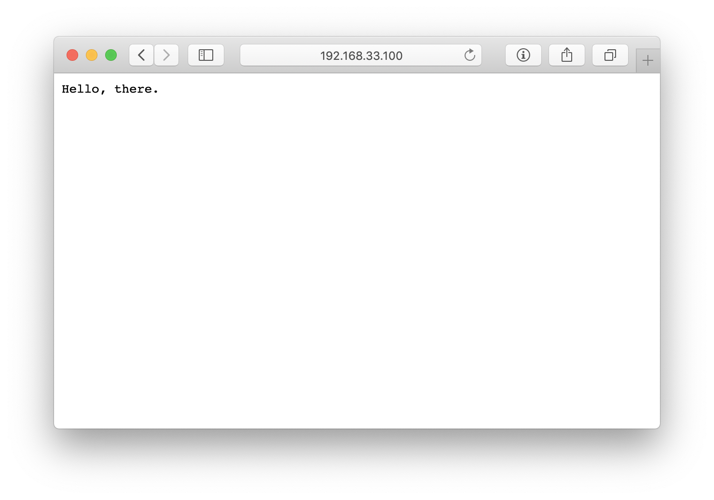

# dockerless

- [CRI-O](https://cri-o.io/): Lightweight container runtime for Kubernetes
  - [Install](https://github.com/cri-o/cri-o/blob/master/install.md)
  - [Running kubernetes with CRI-O](https://github.com/cri-o/cri-o#running-kubernetes-with-cri-o)
  - [Running CRI-O with kubeadm](https://github.com/cri-o/cri-o/blob/master/tutorials/kubeadm.md)
  - [Running CRI-O on kubernetes cluster](https://github.com/cri-o/cri-o/blob/master/tutorials/kubernetes.md)
  - [cri-o-ansible](https://github.com/cri-o/cri-o-ansible)
- [kubeadm](https://kubernetes.io/docs/setup/production-environment/tools/kubeadm/install-kubeadm/)
  - [Installing Addons](https://kubernetes.io/docs/concepts/cluster-administration/addons)
  - [CNI Benchmark](https://itnext.io/benchmark-results-of-kubernetes-network-plugins-cni-over-10gbit-s-network-updated-august-2020-6e1b757b9e49)
  - Calico: [Quickstart](https://docs.projectcalico.org/getting-started/kubernetes/quickstart)
- PDF: [Comparing container image building tools](https://events19.linuxfoundation.org/wp-content/uploads/2017/11/Comparing-Next-Generation-Container-Image-Building-Tools-OSS-Akihiro-Suda.pdf)
- [Container Tools Guide](https://github.com/containers/buildah/tree/master/docs/containertools): Buildah, CRI-O, Podman, Skopeo
  - [Podman](https://podman.io/)
    - [GitHub](https://github.com/containers/podman)
    - [Tutorial](https://github.com/containers/podman/blob/master/docs/tutorials/podman_tutorial.md)
  - [Buildah](https://buildah.io/)
    - [GitHub](https://github.com/containers/buildah)
- [kaniko](https://github.com/GoogleContainerTools/kaniko): Build Container Images In Kubernetes
  - [Getting Started Tutorial](https://github.com/GoogleContainerTools/kaniko/blob/master/docs/tutorial.md)
  - [Running kaniko in a Kubernetes cluster](https://github.com/GoogleContainerTools/kaniko#running-kaniko-in-a-kubernetes-cluster)
  - [Introducing kaniko](https://cloud.google.com/blog/products/gcp/introducing-kaniko-build-container-images-in-kubernetes-and-google-container-builder-even-without-root-access)
- [microk8s](https://microk8s.io/)
  - [Docs](https://microk8s.io/docs)
  - [ubuntu/microk8s](https://github.com/ubuntu/microk8s)
- Helm: [Quickstart Guide](https://helm.sh/docs/intro/quickstart/)
- [Jenkins](https://www.jenkins.io/)
  - [Docs](https://www.jenkins.io/doc/book/)
  - Install
    - [Installing Jenkins on Kubernetes](https://www.jenkins.io/doc/book/installing/kubernetes/)
    - [Install Jenkins with YAML files](https://www.jenkins.io/doc/book/installing/kubernetes/#install-jenkins-with-yaml-files)
    - [Install Jenkins with Helm v3](https://www.jenkins.io/doc/book/installing/kubernetes/#install-jenkins-with-helm-v3)
    - [Install Jenkins Operator](https://www.jenkins.io/doc/book/installing/kubernetes/#install-jenkins-operator)
      - [How to install Jenkins Operator](https://jenkinsci.github.io/kubernetes-operator/docs/installation/)
  - Plugins
    - [Blue Ocean](https://www.jenkins.io/doc/book/blueocean/)
    - [Kubernetes plugin for Jenkins](https://github.com/jenkinsci/kubernetes-plugin)

---

## VM

- Ubuntu Server 20.04 LTS
- CPU: 2
- Memory: 4GB
- IP: `192.168.33.100`
- Kubernetes: `1.19.4`

## (Option) Add a enterprise CA as a trusted certificate authority

Add `*.cer`, `*.crt`, `*.pem` to `.gitignore`.  

`.cer` to `.crt`:
- `openssl x509 -inform DER -in before.cer -noout text`
- `openssl x509 -inform DER -in before.cer -out after.crt`

And copy certificates to `ca-trust` directory:

```bash
cp /path/to/enterprise.crt ./ca-trust
```

## Vagrant

- Vagrant: [Download](https://www.vagrantup.com/downloads)
- VirtualBox: [Download](https://www.virtualbox.org/wiki/Downloads)
- [Vagrantfile](Vagrantfile)

```bash
vagrant box add ubuntu/focal64 # --insecure
vagrant up
vagrant ssh
```

---

## CRI-O

### Install 

- CRI-O github: [APT based operating systems](https://github.com/cri-o/cri-o/blob/master/install.md#apt-based-operating-systems)
- Kubernetes doc: [CRI-O](https://kubernetes.io/docs/setup/production-environment/container-runtimes/#cri-o)

```bash
OS=xUbuntu_20.04
VERSION=1.19
```

```bash
cat <<EOF | sudo tee /etc/apt/sources.list.d/devel:kubic:libcontainers:stable.list
deb https://download.opensuse.org/repositories/devel:/kubic:/libcontainers:/stable/$OS/ /
EOF
cat <<EOF | sudo tee /etc/apt/sources.list.d/devel:kubic:libcontainers:stable:cri-o:$VERSION.list
deb http://download.opensuse.org/repositories/devel:/kubic:/libcontainers:/stable:/cri-o:/$VERSION/$OS/ /
EOF
curl -L https://download.opensuse.org/repositories/devel:kubic:libcontainers:stable:cri-o:$VERSION/$OS/Release.key | sudo apt-key add -
curl -L https://download.opensuse.org/repositories/devel:/kubic:/libcontainers:/stable/$OS/Release.key | sudo apt-key add -

sudo apt-get update
sudo apt-get install -y cri-o cri-o-runc
```

### Start

```bash
sudo systemctl daemon-reload
sudo systemctl enable crio
sudo systemctl start crio
```

---

## Kubernetes

### Setup

```bash
sudo swapoff -a

sudo modprobe br_netfilter # lsmod | grep br_netfilter

cat <<EOF | sudo tee /etc/sysctl.d/k8s.conf
net.bridge.bridge-nf-call-ip6tables = 1
net.bridge.bridge-nf-call-iptables = 1
EOF
sudo sysctl --system | grep k8s

cat <<EOF | sudo tee /proc/sys/net/ipv4/ip_forward
1
EOF
```

### kubelet, kubeadm, kubectl

```bash
sudo apt-get install -y apt-transport-https
curl -s https://packages.cloud.google.com/apt/doc/apt-key.gpg | sudo apt-key add -
cat <<EOF | sudo tee /etc/apt/sources.list.d/kubernetes.list
deb https://apt.kubernetes.io/ kubernetes-xenial main
EOF
sudo apt-get update
sudo apt-get install -y kubelet=1.19.4-00 kubeadm=1.19.4-00 kubectl=1.19.4-00
sudo apt-mark hold kubelet kubeadm kubectl
```

### Configure kubelet

```bash
cat <<EOF | sudo tee /etc/default/kubelet
KUBELET_EXTRA_ARGS=--feature-gates="AllAlpha=false,RunAsGroup=true" --container-runtime=remote --cgroup-driver=systemd --container-runtime-endpoint='unix:///var/run/crio/crio.sock' --runtime-request-timeout=5m
EOF
```

```bash
sudo systemctl daemon-reload
sudo systemctl restart kubelet
```

### Init a cluster

```bash
CIDR=192.168.0.0/16 # Calico CNI
VM_IP=192.168.33.100
sudo kubeadm init --pod-network-cidr=$CIDR --control-plane-endpoint=$VM_IP --apiserver-advertise-address=$VM_IP
```

Result:

```bash
Your Kubernetes control-plane has initialized successfully!

To start using your cluster, you need to run the following as a regular user:

  mkdir -p $HOME/.kube
  sudo cp -i /etc/kubernetes/admin.conf $HOME/.kube/config
  sudo chown $(id -u):$(id -g) $HOME/.kube/config

You should now deploy a pod network to the cluster.
Run "kubectl apply -f [podnetwork].yaml" with one of the options listed at:
  https://kubernetes.io/docs/concepts/cluster-administration/addons/

Then you can join any number of worker nodes by running the following on each as root:

kubeadm join 192.168.33.100:6443 --token wyq927.gaw8fuj1u8be3tm1 \
    --discovery-token-ca-cert-hash sha256:e8a7a22886a9b066861996cc1d19e656516308aceb3c2e560d5bc77df613d29b
```

### Setup kubectl

```bash
mkdir -p $HOME/.kube
sudo cp -i /etc/kubernetes/admin.conf $HOME/.kube/config
sudo chown $(id -u):$(id -g) $HOME/.kube/config
```

### Install Calico

```bash
kubectl create -f https://docs.projectcalico.org/manifests/tigera-operator.yaml
kubectl create -f https://docs.projectcalico.org/manifests/custom-resources.yaml
```

```bash
watch kubectl get po -A
```

### Remove the taints on the master

```bash
kubectl describe node ubuntu-focal | grep Taints

Taints:             node-role.kubernetes.io/master:NoSchedule
```

Remove the taints:

```bash
kubectl taint nodes --all node-role.kubernetes.io/master-

node/ubuntu-focal untainted
```

### Get nodes

```bash
kubectl get nodes -o wide

NAME           STATUS   ROLES    AGE   VERSION   INTERNAL-IP   EXTERNAL-IP   OS-IMAGE             KERNEL-VERSION     CONTAINER-RUNTIME
ubuntu-focal   Ready    master   15m   v1.19.4   10.0.2.15     <none>        Ubuntu 20.04.1 LTS   5.4.0-56-generic   cri-o://1.19.0
```

---

## Container Images

### Docker Registry Secret

[Create a Secret by providing credentials on the command line](https://kubernetes.io/docs/tasks/configure-pod-container/pull-image-private-registry/#create-a-secret-by-providing-credentials-on-the-command-line)

- `docker-server`: Private Docker Registry FQDN. 
  - DockerHub: https://index.docker.io/v1/

```bash
kubectl create secret docker-registry regcred \
--docker-server=<your-registry-server> \ 
--docker-username=<your-name> \
--docker-password=<your-pword> \
--docker-email=<your-email>
```

```bash
kubectl get secret regcred --output="jsonpath={.data.\.dockerconfigjson}" | base64 --decode
```

### Start Kaniko

Node.js App Dockerfile: `/k8s/app/Dockerfile`

```bash
KANIKO_PATH="/k8s/app"
DOCKERHUB_REPO="<user-name>/<repo>"
```

Run kaniko:

```bash
cat /k8s/kaniko/volume.yaml | sed "s#{{path}}#$KANIKO_PATH#g" | kubectl apply -f -
kubectl apply -f /k8s/kaniko/volume-claim.yaml
cat /k8s/kaniko/pod.yaml | sed "s#{{repo}}#$DOCKERHUB_REPO#g" | kubectl apply -f -
```

Check whether the build complete and show the build logs:

```bash
kubectl logs kaniko -f
```

```bash
kubectl get pods

NAME     READY   STATUS      RESTARTS   AGE
kaniko   0/1     Completed   0          42s
```

Go to: `https://hub.docker.com/repository/docker/<user-name>/<repo>`


---

## Deploy a service

```bash
kubectl apply -f /k8s/nginx/configmap.yaml -f /k8s/deployment.yaml
```

Check:

```bash
watch kubectl get pods

NAME                     READY   STATUS      RESTARTS   AGE
hello-8595777499-6np5n   2/2     Running     0          30s
```

---

## Test

On the host machine: [http://192.168.33.100:30080](http://192.168.33.100:30080)



## Delete a service

```bash
kubectl delete -f /k8s/nginx/configmap.yaml -f /k8s/deployment.yaml
```

---

## Git server

### Create git user

```bash
sudo adduser --shell /usr/bin/git-shell --disabled-password --gecos "" git
echo git:12345 | sudo chpasswd
sudo -u git mkdir -m 700 /home/git/.ssh /home/git/repos /home/git/git-shell-commands
```

### Set git-shell-commands

```bash
cat <<EOF | sudo -u git tee /home/git/git-shell-commands/no-interactive-login
#!/bin/sh
printf '%s\n' "Hi! You've successfully authenticated, but I do not"
printf '%s\n' "provide interactive shell access."
exit 128
EOF
sudo chmod +x /home/git/git-shell-commands/no-interactive-login
```

### Generate a pair keys

```bash
ssh-keygen -t ed25519 -C "your_email@example.com" -f $HOME/.ssh/id_ed25519 -q -N ""
```

```bash
ls -1 $HOME/.ssh/id_*

/home/vagrant/.ssh/id_ed25519
/home/vagrant/.ssh/id_ed25519.pub
```

SSH add:

```bash
eval $(ssh-agent)
ssh-add ~/.ssh/id_ed25519
```

Copy keys:

```bash
cat $HOME/.ssh/id_ed25519.pub | sudo tee -a /home/git/.ssh/authorized_keys
```

### Create a new repo

#### Copy a node.js project

```bash
mkdir $HOME/workspace
cp -r /k8s/app $HOME/workspace/app
```

#### Init a git repository

```bash
cd $HOME/workspace/app
git init --shared=true
git config --global user.email "you@example.com"
git config --global user.name "Your Name"
git add .
git commit -m "first commit"
```

#### Create a bare repository

```bash
cd $HOME/workspace
git clone --bare app app.git
```

#### Copy repositories

```bash
sudo cp -r $HOME/workspace/app.git /home/git/repos
sudo chown -R git:git /home/git/repos
sudo chmod -R ug+rwX /home/git/repos
sudo find /home/git/repos -type d -exec chmod g+s '{}' +
```

#### Test clone a repository

```bash
git clone ssh://git@192.168.33.100/~/repos/app.git /tmp/app
```

```bash
Cloning into '/tmp/app'...
remote: Enumerating objects: 8, done.
remote: Counting objects: 100% (8/8), done.
remote: Compressing objects: 100% (8/8), done.
remote: Total 8 (delta 0), reused 0 (delta 0)
Receiving objects: 100% (8/8), 7.39 KiB | 7.39 MiB/s, done.
```

---

## Jenkins

### Create a namespace

```bash
kubectl create namespace jenkins
```

### Create a service account

```bash
kubectl apply -f /k8s/jenkins/sa.yaml
```

### Deploy Jenkins

```bash
kubectl apply -f /k8s/jenkins/deployment.yaml
```

### Get Jenkins credentials

```bash
kubectl exec -n jenkins $(kubectl get pods -n jenkins -l app=jenkins --no-headers -o custom-columns=":metadata.name") \
-- cat /var/jenkins_home/secrets/initialAdminPassword

# 3d355c615186450291f868c4f4155c7e
```

### Access Jenkins dashboard 

[http://192.168.33.100:32080](http://192.168.33.100:32080)

1. Unlocking Jenkins
1. Install suggested plugins
1. Create first admin user: `admin`
1. Instance configuration
   - Jenkins URL: `http://192.168.33.100:32080/`

### (Skip) Install plugins

[Installed plugin list](http://192.168.33.100:32080/pluginManager/installed): Already installed the Kubernetes plugin.

How to install plugins:

1. Go to [http://192.168.33.100:32080/pluginManager/available](http://192.168.33.100:32080/pluginManager/available).
1. Search `kubernetes`, `git`, `pipeline`, `Shared workspace`.
1. Install plugins and restart Jenkins.
   - `Kubernetes`, `Kubernetes :: Pipeline :: DevOps Steps`
   - `Git`
   - `Pipeline`
   - `Shared workspace`

### Shared Workspace

1. [System Configuration](http://192.168.33.100:32080/configure)
1. Workspace Sharing
   1. Workspaces Name: `my_project`
   1. URL: `ssh://git@192.168.33.100/~/repos/app.git`
1. Save

### Kubernetes Cloud configuration

1. Jenkins: [Configure Clouds](http://192.168.33.100:32080/configureClouds/)
1. Add a new cloud: kubernetes
   - Kubernetes URL: `https://192.168.33.100:6443` or `https://kubernetes.default.svc.cluster.local`
   - Kubernetes Namespace: `jenkins`
   - Credentials
     - Kind: `Kubernetes Service Account`
   - Direct Connection: enabled
   - Jenkins URL: `http://192.168.33.100:32080`
   - Jenkins tunnel: `http://192.168.33.100:32081`
1. [System Configuration](http://192.168.33.100:32080/configure) → Jenkins Location → URL: `http://192.168.33.100:32080`
1. [Configure Global Security](http://192.168.33.100:32080/configureSecurity/) → Agents: TCP port for inbound agents	`32081`

---

## Create a Pipeline

### Git Hook: post-receive

```bash
cat <<EOF | sudo -u git tee /home/git/repos/app.git/hooks/post-receive
#!/bin/sh
curl http://192.168.33.100:32080/git/notifyCommit?url=ssh://git@192.168.33.100/~/repos/app.git
EOF
sudo chmod 775 /home/git/repos/app.git/hooks/post-receive
```

### Creat a Folder

1. [Create a job](http://192.168.33.100:32080/newJob)
   1. Enter an item name: `My Pipelines`
   1. Select `Folder`
1. Save

### Create a Job 1

1. Go to `My Pipelines` → Creat a Job
   1. Enter an item name: `Git Hook`
   1. Select `Freestyle project`
1. General → Shared Workspace: `my_project (ssh://git@192.168.33.100/~/repos/app.git)`
1. Source Code Management: Git
   - Repository URL: `ssh://git@192.168.33.100/~/repos/app.git`
   - Credentials: make `git`
     1. Add
     1. Kind: `SSH Username with private key`
     1. Username: `git`
     1. Private Key: enter `id_ed25519`.
1. Build Triggers: Poll SCM enabled (No polling schedule is required.)
1. Save

### Creat a Job 2

1. Go to `My Pipelines` → Creat a Job
   1. Enter an item name: `Build a image`
   1. Select `Pipeline`
1. Build Triggers → Build after other projects are built → `git hook`
1. Add Pipeline and Save

Script:

```groovy
pipeline {
  agent {
    kubernetes {
      defaultContainer 'kaniko'
      yaml """
kind: Pod
metadata:
  name: kaniko
spec:
  containers:
  - name: kaniko
    image: gcr.io/kaniko-project/executor:latest
    imagePullPolicy: Always
    args: ["--dockerfile=/workspace/Dockerfile", "--destination=rurumimic/hellothere"]
    tty: true
    volumeMounts:
      - name: jenkins-docker-cfg
        mountPath: /kaniko/.docker
      - name: dockerfile-storage
        mountPath: /workspace
  volumes:
  - name: jenkins-docker-cfg
    projected:
      sources:
      - secret:
          name: regcred
          items:
            - key: .dockerconfigjson
              path: config.json
  - name: dockerfile-storage
    hostPath:
      path: /var/jenkins_home/sharedspace/my_project
"""
    }
  }
  stages {
    stage('Build with Kaniko') {
      steps {
        sh 'ls -al /workspace'
      }
    }
  }
}
```

```groovy
podTemplate(yaml: """
kind: Pod
spec:
  containers:
  - name: kaniko
    image: gcr.io/kaniko-project/executor:latest
    imagePullPolicy: Always
    command:
    - /busybox/cat
    tty: true
    volumeMounts:
      - name: kaniko-secret
        mountPath: /kaniko/.docker
      - name: dockerfile-storage
        mountPath: /workspace
  volumes:
  - name: kaniko-secret
    secret:
      secretNname: regcred
      items:
        - key: .dockerconfigjson
          path: config.json
  - name: dockerfile-storage
    hostPath:
      path: /var/jenkins_home/sharedspace/my_project
"""
  ) {

  node(POD_LABEL) {
    stage('Build with Kaniko') {
      container('kaniko') {
        sh '/kaniko/executor -f /workspace/Dockerfile -c /workspace --cache=true --destination=rurumimic/hellothere'
      }
    }
  }
}
```

---

## Commit and Deploy

### Create a secret for jenkins branch

```bash
kubectl create secret docker-registry regcred -n jenkins \
--docker-server=https://index.docker.io/v1/ \ 
--docker-username=<your-name> \
--docker-password=<your-pword> \
--docker-email=<your-email>
```

### Clone a repository

```bash
git clone ssh://git@192.168.33.100/~/repos/app.git /tmp/app
```

### Edit

```bash
cd /tmp/app
sed -i 's/Hello/Hi/' app.js
```

### Commit and Push

```bash
git add .
git commit -m "Update"
git push
```

### Test

Go to Jenkins: [my-project](http://192.168.33.100:32080/job/my-project/)

And your Docker Hub repository.

---

## Clean up VM

```bash
vagrant halt
vagrant destroy -f
```
